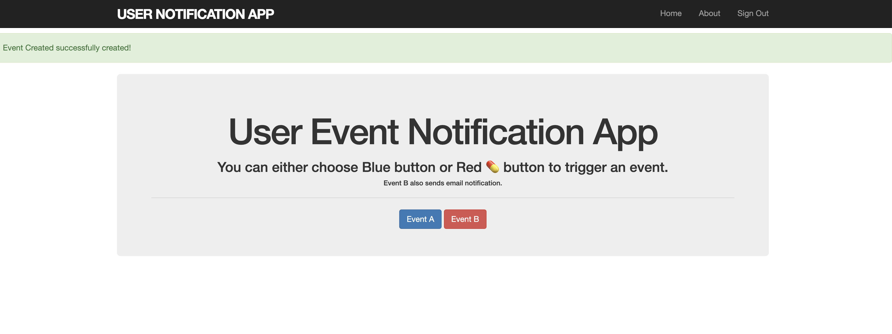

# README

## Instructions
```
# cd into project folder
bundle install
rails db:migrate

# make sure nothing's running on port 3000, else use -p option to specify port
rails server
# open http://localhost:3000/
```




## Notes
* Tests are done in hurry because I wanted to save time.
* Sidekiq and Workers aren't used to save time.
* Ideally, I should have deployed to heroku.
* I would like to discuss the rest of the trade off in a meeting.
* The flash notification should be dismissable. It should also auto close.
* When button is clicked, there should be a visual feedback. For example, disable the button until we get back the response & show the loader.
* Authorization can be improved.